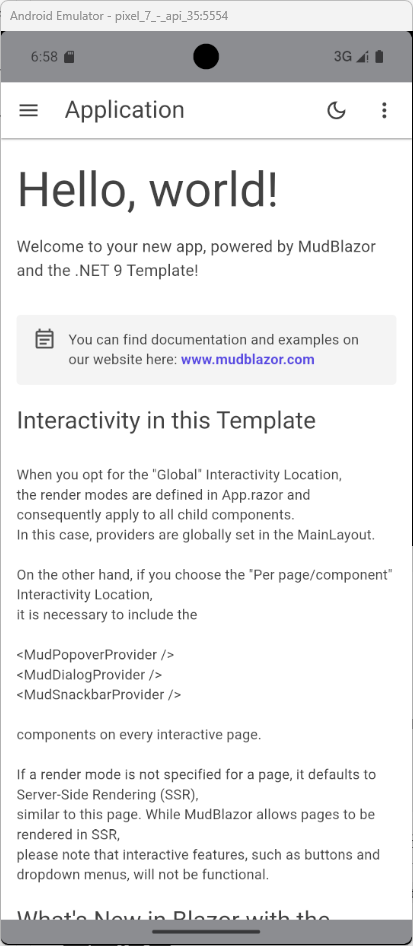

# Sky.Avalonia.WebView2 
[English](README.md)|[中文](README_ZH_CN.md)
适用于avalonia的WebView2控件，支持Blazor。
项目从https://github.com/sakib1361/Avalonia.WebView2 分叉而来，并进行了修改。
## 使用说明
## 安装
例如你的Avalonia 项目名`TestApp`，使用的多项目结构
### 1. 安装 NuGet 包
1.在`TestApp`中安装
BlazorWebView
```
dotnet add package Sky.Avalonia.BlazorWebView
```
或WebView
```
dotnet add package Sky.Avalonia.WebView
```
2.在`TestApp.Desktop`中安装
```
dotnet add package Sky.Avalonia.WebView.Desktop
```
或在`TestApp.Android`中安装
```
dotnet add package Sky.Avalonia.WebView.Android
```
3.编辑文件：`App.axaml.cs`
```
 using AvaloniaWebView;

 OR

 using AvaloniaBlazorWebView;
 ...
  public override void RegisterServices()
  {
     base.RegisterServices();
     
     // if you use only WebView  
     AvaloniaWebViewBuilder.Initialize(default);

     // Or
 
     // if you use BlazorWebView, please setting for blazor 
     AvaloniaBlazorWebViewBuilder.Initialize(default, setting =>
     {

         //because avalonia support the html css and js for resource ,so you must set the ResourceAssembly 
         setting.IsAvaloniaResource = true;
         setting.ResourceAssembly = typeof(TestApp).Assembly;
     }, inject =>
     {
         //you can inject the resource in this
         inject.AddSingleton<WeatherForecastService>();
     });
  }
```
4.编辑文件：`MainView.axaml` 

```
<UserControl xmlns="https://github.com/avaloniaui"
             xmlns:x="http://schemas.microsoft.com/winfx/2006/xaml"
             xmlns:d="http://schemas.microsoft.com/expression/blend/2008"
             xmlns:mc="http://schemas.openxmlformats.org/markup-compatibility/2006"
             xmlns:vm="clr-namespace:TestApp.ViewModels"
             mc:Ignorable="d" d:DesignWidth="800" d:DesignHeight="450"
             x:Class="TestApp.Views.MainView"
             x:DataType="vm:MainViewModel">
  <Design.DataContext>
    <vm:MainViewModel />
  </Design.DataContext>
	<BlazorWebView x:Name="blazorWebView"/>
</UserControl>
```
5.编辑文件：`MainView.axaml.cs` 

```
using Avalonia.Controls;
using Avalonia.Interactivity;
namespace TestApp.Views;

public partial class MainView : UserControl
{
    public MainView()
    {
        InitializeComponent();
        this.blazorWebView.HostPage = "wwwroot/index.html";
        this.blazorWebView.RootComponents.Add(new AvaloniaBlazorWebView.Components.BlazorRootComponent
        {
            ComponentType= typeof(TestApp.Web.Shared.Components.Routes),
            Selector= "#mainapp"
        });
        this.blazorWebView.WebViewNewWindowRequested+=BlazorWebView_WebViewNewWindowRequested;
    }

    private void BlazorWebView_WebViewNewWindowRequested(object? sender, WebView.Core.Events.WebViewNewWindowEventArgs e)
    {
        e.UrlLoadingStrategy=WebView.Core.Enums.UrlRequestStrategy.OpenInNewWindow;//在新窗口中打开链接
    }

   ......
}
```
6.编辑Desktop项目的`Program.cs` 或Android项目的`MainActivity.cs`
Desktop项目：
```
public static AppBuilder BuildAvaloniaApp()
    => AppBuilder.Configure<App>()
        .UsePlatformDetect()
        .WithInterFont()
        .LogToTrace()
        .UseWindowWebView();//add this line
```
Android项目：
```
protected override AppBuilder CustomizeAppBuilder(AppBuilder builder)
{
    
    return base.CustomizeAppBuilder(builder)
        .WithInterFont()
        .UseAndroidWebView();//add this line
}
```
## 注意事项
运行Blazor时，`TestApp` `TestApp.Desktop` `TestApp.Android` `<Project Sdk="Microsoft.NET.Sdk">` 必须改为 `<Project Sdk="Microsoft.NET.Sdk.Razor">`
1.文件：`TestApp.csproj` 修改或增加
```
...
<ItemGroup>
  <Content Update="wwwroot\**">
    <CopyToOutputDirectory>PreserveNewest</CopyToOutputDirectory>
  </Content>
</ItemGroup>
...
```
2.文件：`TestApp.Android.csproj` 修改或增加

```
<PropertyGroup>
    ...
    <StaticWebAssetsEnabled>false</StaticWebAssetsEnabled>
</PropertyGroup>
...
<ItemGroup>
  <AndroidAsset Include="wwwroot\**">
    <CopyToOutputDirectory>PreserveNewest</CopyToOutputDirectory>
  </AndroidAsset>
</ItemGroup>
...
```
3.将TestApp下的wwwroot文件夹下的文件复制一份到TestApp.Android的wwwroot文件夹下。
4.如果使用Blazor UI，例如MudBlazor，请将_content/MudBlazor/* 文件原样复制到TestApp.Android的wwwroot文件夹下。

## 参考项目
https://github.com/jkh404/Avalonia.WebView2/tree/master/TestApp
## 展示图片


